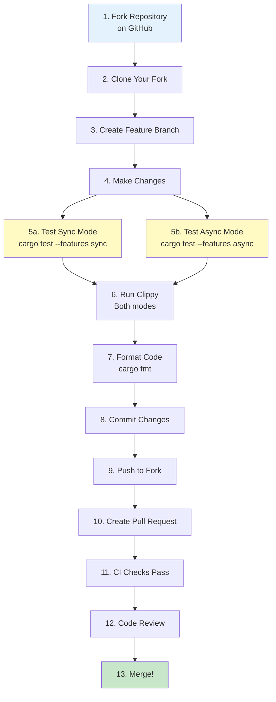

# Contributing to rust-ibapi

Thank you for your interest in contributing! This guide will help you get started.

## Important: Feature Flags

**rust-ibapi requires you to choose exactly ONE feature:**
- `--features sync` - For synchronous, thread-based execution
- `--features async` - For asynchronous, tokio-based execution

These features are **mutually exclusive**. All commands must specify one.

## Quick Start

1. **Fork** the repository on GitHub
2. **Clone** your fork: `git clone https://github.com/<your-username>/rust-ibapi`
3. **Test** your setup: 
   ```bash
   cargo test --features sync
   cargo test --features async
   ```
4. **Make** your changes
5. **Verify** both modes work:
   ```bash
   cargo test --features sync
   cargo test --features async
   cargo clippy --features sync
   cargo clippy --features async
   cargo fmt
   ```
6. **Submit** a pull request

## Contribution Flow



## Table of Contents

- [Development Setup](#development-setup)
- [Making Changes](#making-changes)
- [Testing](#testing)
- [Code Style](#code-style)
- [Submitting Pull Requests](#submitting-pull-requests)
- [Documentation](#documentation)
- [Advanced Topics](#advanced-topics)

## Development Setup

### Prerequisites

1. [Install Rust](https://www.rust-lang.org/tools/install)
2. Install development tools:
   ```bash
   cargo install cargo-tarpaulin  # For code coverage
   cargo install cargo-audit       # For security audits
   ```
3. Fork and clone the repository
4. Verify your environment works with both features:
   ```bash
   # Test sync mode
   cargo test --features sync
   
   # Test async mode
   cargo test --features async
   ```

### Recommended IDE Setup

- VS Code with rust-analyzer extension
- Configure rustfmt and clippy for automatic formatting and linting

## Making Changes

### Basic Workflow

1. Create a feature branch:
   ```bash
   git checkout -b feature/your-feature-name
   ```

2. Make your changes following our [code style guidelines](docs/code-style.md)

3. Test both feature modes:
   ```bash
   cargo test --features sync
   cargo test --features async
   ```

4. Run quality checks:
   ```bash
   cargo fmt
   cargo clippy --features sync -- -D warnings
   cargo clippy --features async -- -D warnings
   ```

### Common Tasks

- **Adding a new API method**: See [Extending the API](docs/extending-api.md)
- **Fixing a bug**: Include a test that reproduces the issue
- **Improving documentation**: Update both code docs and markdown files
- **Adding examples**: Create both sync and async versions in `examples/`

## Testing

### Running Tests

Always test both sync and async modes:

```bash
# Run all tests for both modes
cargo test --features sync
cargo test --features async

# Run specific test
cargo test test_name --features sync
cargo test test_name --features async

# Run with output
cargo test --features sync -- --nocapture

# Generate coverage report
cargo tarpaulin -o html --features sync
```

### Writing Tests

- Use table-driven tests for comprehensive coverage
- Share test data between sync/async implementations
- Test error cases and edge conditions
- See [Testing Patterns](docs/testing-patterns.md) for detailed guidelines

### Integration Testing

The project uses a MockGateway for integration tests:
- Tests real TCP connections
- Verifies protocol correctness
- Ensures sync/async parity

## Code Style

### Key Guidelines

- Follow [Rust API Guidelines](https://rust-lang.github.io/api-guidelines/)
- Use `cargo fmt` before committing
- Address all `cargo clippy` warnings
- Keep comments concise and meaningful
- Avoid stating the obvious in comments

### Feature-Specific Code

Since features are mutually exclusive, use simple guards:

```rust
// For sync-only code
#[cfg(feature = "sync")]
use std::thread;

// For async-only code
#[cfg(feature = "async")]
use tokio::task;
```

See [Code Style Guidelines](docs/code-style.md) for more details.

## Submitting Pull Requests

### Before Submitting

1. **Test both modes** - Ensure all tests pass for both features
2. **Run quality checks**:
   ```bash
   cargo fmt --check
   cargo clippy --features sync -- -D warnings
   cargo clippy --features async -- -D warnings
   ```
3. **Update documentation** if needed
4. **Add tests** for new functionality
5. **Check coverage** hasn't decreased significantly

### Pull Request Process

1. Push your branch to your fork
2. Create a pull request against the `main` branch
3. Fill out the PR template with:
   - Description of changes
   - Testing performed
   - Any breaking changes
4. Wait for CI checks to pass
5. Address review feedback
6. Once approved, your PR will be merged

### Commit Messages

- Use clear, descriptive commit messages
- Start with a verb (Add, Fix, Update, Remove)
- Reference issues when applicable: "Fix #123: Description"

## Documentation

### Types of Documentation

1. **Code Documentation** - Rust doc comments (`///` and `//!`)
2. **Examples** - Working code in `examples/` directory
3. **Guides** - Markdown files in `docs/` directory
4. **API Reference** - Generated from doc comments

### Documentation Standards

- Keep explanations clear and concise
- Include examples for complex functionality
- Update relevant docs when changing behavior
- Test all code examples

### Key Documentation Files

- [Quick Start Guide](docs/quick-start.md) - Get started quickly with rust-ibapi
- [Architecture Overview](docs/architecture.md) - System design and components
- [API Patterns](docs/api-patterns.md) - Common usage patterns
- [Feature Flags](docs/feature-flags.md) - Detailed feature flag guide
- [Examples Guide](docs/examples.md) - How to run and write examples

## Advanced Topics

For more complex contributions, see these guides:

- [Extending the API](docs/extending-api.md) - Adding new TWS API functionality
- [Architecture Details](docs/architecture.md) - Deep dive into system design
- [Testing Patterns](docs/testing-patterns.md) - Advanced testing techniques
- [Build and Test](docs/build-and-test.md) - CI/CD and build configuration
- [Troubleshooting](docs/troubleshooting.md) - Common issues and solutions

## Domain Type Pattern

The codebase uses newtype wrappers for type safety:

```rust
#[derive(Debug, Clone, PartialEq, Eq, Hash)]
pub struct AccountId(pub String);

impl Deref for AccountId {
    type Target = str;
    fn deref(&self) -> &Self::Target {
        &self.0
    }
}

impl From<String> for AccountId {
    fn from(s: String) -> Self {
        Self(s)
    }
}
```

This pattern provides:
- Type safety (can't mix different ID types)
- Self-documenting code
- Zero runtime overhead
- Better IDE support

## Troubleshooting

### Environment Variables

```bash
# Enable debug logging
RUST_LOG=debug cargo run --features sync --example example_name

# Record TWS messages for debugging
IBAPI_RECORDING_DIR=/tmp/tws-messages cargo run --features sync --example example_name
```

### Common Issues

- **"no feature specified"** - Add `--features sync` or `--features async`
- **"mutually exclusive features"** - Use only one feature flag
- **Tests failing** - Ensure you're testing with the correct feature flag
- **Clippy warnings** - Run clippy for both features separately

For detailed solutions, see the [Troubleshooting Guide](docs/troubleshooting.md).

## Getting Help

- Check existing [issues](https://github.com/wboayue/rust-ibapi/issues)
- Ask questions in discussions
- Review the [documentation](docs/)
- Look at existing examples in `examples/`

## Creating Releases

For maintainers creating new releases:

1. Update version in `Cargo.toml`
2. Run all tests and checks
3. Create and push version tag
4. Create GitHub release
5. Publish to crates.io with `cargo publish`

See the full release process in the advanced documentation.

Thank you for contributing to rust-ibapi!