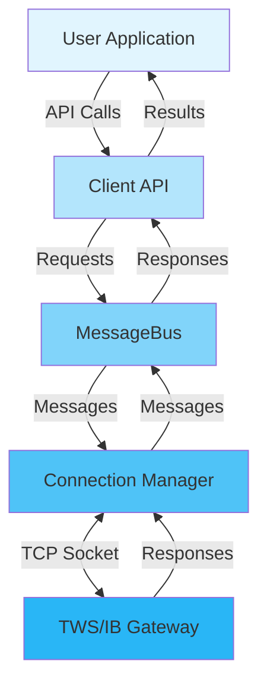
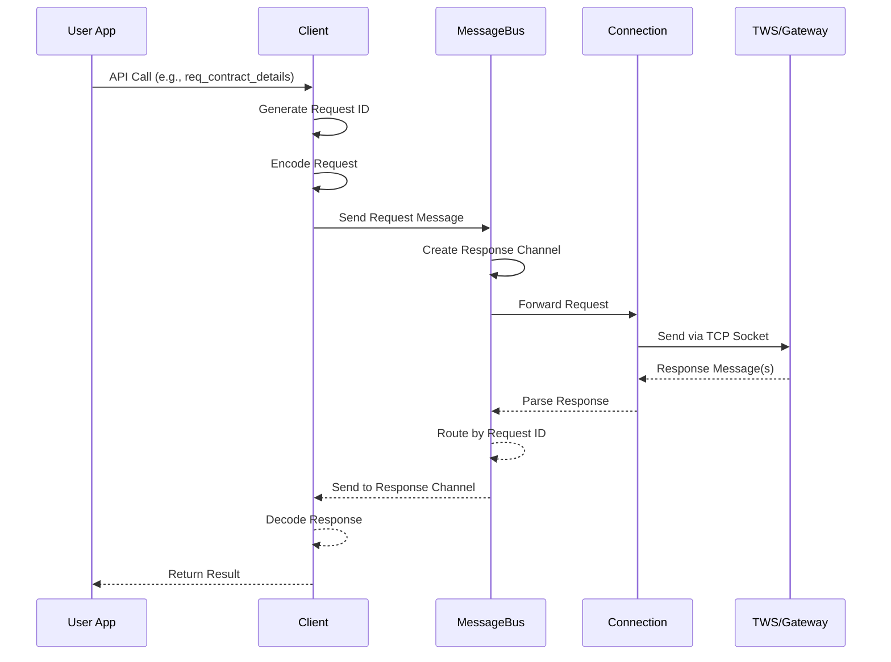
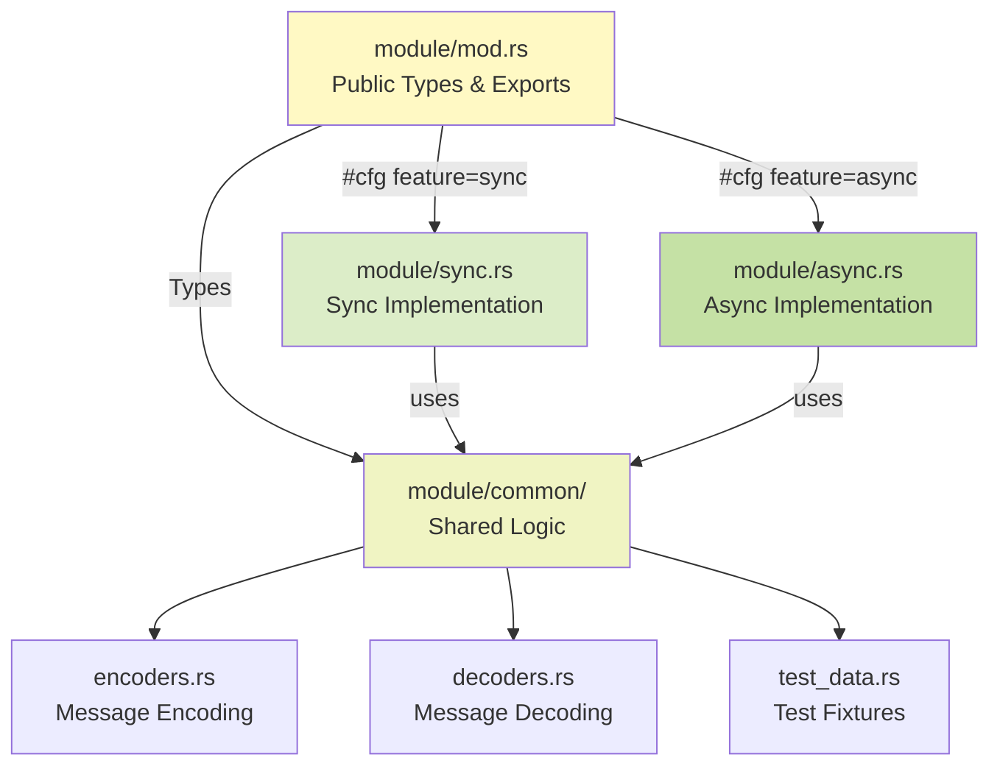

# Architecture Overview

The rust-ibapi crate is a Rust implementation of the Interactive Brokers TWS API. The architecture supports both synchronous (thread-based) and asynchronous (tokio-based) operation modes; the async client is enabled by default, and the blocking client can be added alongside it.

## System Architecture



## Core Components

### 1. Client
Main interface for user interactions:
- **Sync mode**: Uses threads and crossbeam channels
- **Async mode**: Uses tokio tasks and mpsc channels
- Encodes user requests
- Sends requests to the MessageBus
- Receives responses via channels
- Decodes responses for the user

### 2. MessageBus
Handles connection and message routing:
- **Sync mode**: Runs on a dedicated thread
- **Async mode**: Runs as a tokio task
- Establishes and maintains connection to TWS/Gateway
- Sends messages from client to TWS
- Listens for messages from TWS
- Routes incoming messages to appropriate client channels
- Implements automatic reconnection with Fibonacci backoff

### 3. Connection
Low-level connection management:
- Handles TWS protocol handshake
- Manages socket I/O operations
- Implements reconnection logic
- Maintains connection metadata

## Request/Response Flow



### Message Routing Patterns

1. **Requests with IDs**: MessageBus creates dedicated channels for responses
2. **Requests without IDs**: MessageBus uses shared channels for responses
3. **Order-based requests**: Special handling for order tracking

## Module Structure



Each API module follows a consistent structure:

```
src/<module>/
├── mod.rs         # Public types and module exports
├── common/        # Shared implementation details
│   ├── mod.rs     # Export encoders/decoders
│   ├── encoders.rs # Message encoding functions
│   └── decoders.rs # Message decoding functions
├── sync.rs        # Synchronous implementation
└── async.rs       # Asynchronous implementation
```

### Example Module Implementation

```rust
// src/accounts/mod.rs - Public types (always available)
#[derive(Debug)]
pub struct AccountSummary {
    pub account: String,
    pub tag: String,
    pub value: String,
    pub currency: String,
}

// Feature-specific implementations
#[cfg(feature = "sync")]
mod sync;

#[cfg(feature = "async")]
mod r#async;

// Re-export API functions based on active feature
#[cfg(feature = "sync")]
pub use sync::{account_summary, positions};

#[cfg(feature = "async")]
pub use r#async::{account_summary, positions};
```

This structure ensures:
- Public types are always available regardless of feature flags
- Shared business logic in common/encoders and common/decoders
- Clear separation between public API (types) and implementation
- No code duplication for encoding/decoding
- Easy debugging and maintenance

## Key Modules

- **`accounts`**: Account management and portfolio information
- **`contracts`**: Contract definitions and search
- **`market_data`**: Real-time and historical market data
- **`orders`**: Order placement and management
- **`news`**: News bulletins and articles
- **`wsh`**: Wall Street Horizon event data
- **`transport`**: Connection and message handling (internal)
- **`messages`**: Message definitions and routing (internal)
- **`protocol`**: Protocol version constants and feature checking

## Multi-Threading Model

The `Client` can be shared between threads for concurrent operations:

1. **Thread-Safe Design**: Use `Arc<Client>` when sharing across threads
2. **Channel Isolation**: Each subscription gets its own channel
3. **Subscription Model**: Subscriptions can be converted to iterators (sync) or streams (async)

## Connection Management

### Connection States
- **Connected**: Active connection to TWS/Gateway
- **Reconnecting**: Attempting to restore connection
- **Shutdown**: Connection closed, no reconnection attempts

### Reconnection Strategy
- Automatic reconnection on connection loss
- Fibonacci backoff (1, 2, 3, 5, 8... seconds)
- Maximum 20 reconnection attempts
- Configurable via `MAX_RECONNECT_ATTEMPTS`

### Connection Monitoring
Use `client.is_connected()` to check connection status:
```rust
if client.is_connected() {
    // Safe to make API calls
}
```

## Important Design Considerations

1. **Shared Channels**: Some TWS API calls don't have unique request IDs and use shared channels. Avoid concurrent requests of the same type.

2. **Message Ordering**: TWS doesn't guarantee message ordering for different request types.

3. **Rate Limiting**: TWS has rate limits. The library doesn't enforce these - applications must manage their request rates.

4. **Error Recovery**: Connection errors trigger automatic reconnection. Application errors must be handled by the caller.
