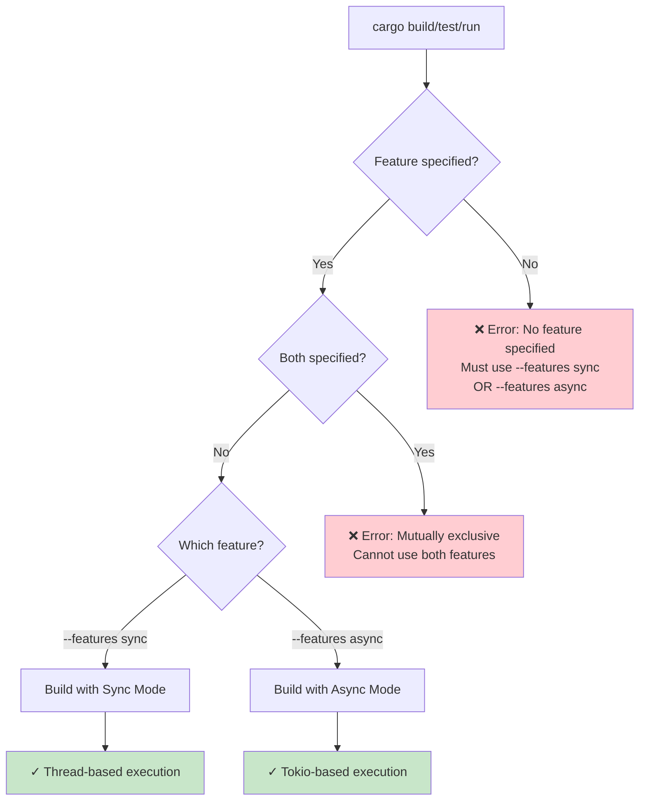

# Feature Flags

The library requires you to explicitly choose one of two mutually exclusive features.

## Feature Selection Flow



## Available Features

- **`sync`**: Traditional synchronous API using threads and crossbeam channels
- **`async`**: Asynchronous API using tokio and async/await

There is no default feature. You must specify exactly one:

```bash
# For sync mode
cargo build --features sync

# For async mode
cargo build --features async
```

If you don't specify a feature, you'll get a helpful compile error explaining how to use the crate.

## Feature Guard Pattern

Since the features are mutually exclusive, you can use simple feature guards:

```rust
#[cfg(feature = "sync")]
use std::thread;

#[cfg(feature = "async")]
use tokio::task;
```

The crate enforces that exactly one feature is enabled at compile time.

## Module Organization for Features

Each module follows this pattern to support both modes:

```rust
// mod.rs - Public types (always available)
pub struct MyType { ... }

// Feature-specific implementations
#[cfg(feature = "sync")]
mod sync;

#[cfg(feature = "async")]
mod r#async;

// Re-export the appropriate implementation
#[cfg(feature = "sync")]
pub use sync::my_function;

#[cfg(feature = "async")]
pub use r#async::my_function;
```

## Usage in Cargo.toml

### For library users:
```toml
# Choose one:
ibapi = { version = "2.0", features = ["sync"] }
# OR
ibapi = { version = "2.0", features = ["async"] }
```

### For examples:
```toml
[[example]]
name = "async_market_data"
path = "examples/async/market_data.rs"
required-features = ["async"]

[[example]]
name = "market_data"
path = "examples/sync/market_data.rs"
required-features = ["sync"]
```

## Testing with Features

Always test both feature flags:

```bash
# Test sync implementation
cargo test --features sync

# Test async implementation
cargo test --features async

# Run specific test for both
cargo test test_name --features sync
cargo test test_name --features async
```

## Key Differences

### Sync Mode
- Uses `std::thread` for concurrency
- Crossbeam channels for communication
- Blocking I/O operations
- Returns `Result<T, Error>`
- Subscriptions implement `Iterator`

### Async Mode
- Uses `tokio` runtime
- `tokio::sync` primitives
- Non-blocking I/O with `.await`
- Returns `Result<T, Error>` (with `.await`)
- Subscriptions implement `Stream`