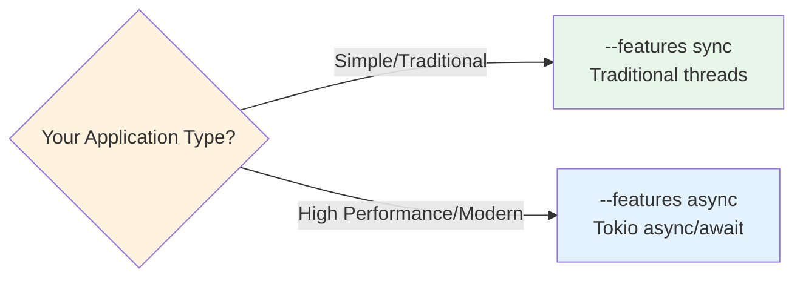

# Quick Start Guide

Get up and running with rust-ibapi in minutes.

## Prerequisites

Before you begin, ensure you have:
1. **Rust installed** - [Install Rust](https://www.rust-lang.org/tools/install)
2. **IB Gateway or TWS** - Running and configured for API connections
3. **Git** - For cloning the repository

## Critical: Choose Your Feature

⚠️ **rust-ibapi requires exactly ONE feature flag:**



- **`--features sync`** - Traditional synchronous execution using threads
- **`--features async`** - Modern asynchronous execution using tokio

These are **mutually exclusive** - you cannot use both.

## Installation

### As a Dependency

Add to your `Cargo.toml`:

```toml
[dependencies]
# Choose ONE:
ibapi = { version = "2.0", features = ["sync"] }
# OR
ibapi = { version = "2.0", features = ["async"] }
```

### For Development

```bash
# Clone the repository
git clone https://github.com/wboayue/rust-ibapi.git
cd rust-ibapi

# Verify installation (choose ONE feature)
cargo build --features sync
# OR
cargo build --features async
```

## Your First Example

### Step 1: Start IB Gateway/TWS

Ensure your IB Gateway or TWS is running with API connections enabled:

| Platform | Paper Trading | Live Trading |
|----------|--------------|--------------|
| IB Gateway | 127.0.0.1:4002 | 127.0.0.1:4001 |
| TWS | 127.0.0.1:7497 | 127.0.0.1:7496 |

### Step 2: Run a Simple Example

#### Sync Version

Create `src/main.rs`:

```rust
use ibapi::Client;

fn main() -> Result<(), Box<dyn std::error::Error>> {
    // Connect to IB Gateway Paper Trading
    let client = Client::connect("127.0.0.1:4002", 100)?;
    
    // Request current time
    let server_time = client.server_time()?;
    println!("Server time: {}", server_time);
    
    // Get account summary
    let account_summary = client.account_summary()?;
    for item in account_summary {
        println!("{}: {} {}", item.tag, item.value, item.currency);
    }
    
    Ok(())
}
```

Run with:
```bash
cargo run --features sync
```

#### Async Version

Create `src/main.rs`:

```rust
use ibapi::Client;

#[tokio::main]
async fn main() -> Result<(), Box<dyn std::error::Error>> {
    // Connect to IB Gateway Paper Trading
    let client = Client::connect("127.0.0.1:4002", 100).await?;
    
    // Request current time
    let server_time = client.server_time().await?;
    println!("Server time: {}", server_time);
    
    // Get account summary
    let account_summary = client.account_summary().await?;
    for item in account_summary {
        println!("{}: {} {}", item.tag, item.value, item.currency);
    }
    
    Ok(())
}
```

Run with:
```bash
cargo run --features async
```

## Common Operations

### Requesting Market Data

```rust
// Define a stock contract
let contract = Contract::stock("AAPL");

// Request real-time bars (sync)
let subscription = client.realtime_bars(&contract, BarSize::Sec5, WhatToShow::Trades, false)?;
for bar in subscription {
    println!("Price: {}, Volume: {}", bar.close, bar.volume);
}

// Request real-time bars (async)
let mut subscription = client.realtime_bars(&contract, BarSize::Sec5, WhatToShow::Trades, false).await?;
while let Some(bar) = subscription.next().await {
    println!("Price: {}, Volume: {}", bar.close, bar.volume);
}
```

### Placing Orders

```rust
// Create a market order
let contract = Contract::stock("AAPL");
let order = Order::market_order(Action::Buy, 100.0);

// Place the order
let order_id = client.next_order_id();
client.place_order(order_id, &contract, &order)?;
```

### Getting Account Information

```rust
// Get positions
let positions = client.positions()?;
for position in positions {
    println!("{}: {} shares", position.contract.symbol, position.size);
}

// Get account values
let account_values = client.account_values()?;
for value in account_values {
    println!("{}: {}", value.key, value.value);
}
```

## Running Examples

The repository includes many examples in the `examples/` directory:

```bash
# List all examples
ls examples/

# Run a sync example
cargo run --features sync --example account_summary

# Run an async example  
cargo run --features async --example async_account_summary

# Run with debug logging
RUST_LOG=debug cargo run --features sync --example market_data
```

### Popular Examples

| Example | Description | Command |
|---------|-------------|---------|
| `account_summary` | Display account information | `cargo run --features sync --example account_summary` |
| `market_data` | Stream real-time quotes | `cargo run --features sync --example market_data` |
| `place_order` | Place a simple order | `cargo run --features sync --example place_order` |
| `historical_data` | Fetch historical bars | `cargo run --features sync --example historical_data` |
| `contract_details` | Get contract information | `cargo run --features sync --example contract_details` |

For async versions, use `--features async` and prefix the example name with `async_`.

## Troubleshooting

### Common Issues and Solutions

#### "No feature specified" Error
```bash
error: no feature specified. Enable either 'sync' or 'async' feature
```
**Solution**: Add `--features sync` or `--features async` to your command.

#### "Mutually exclusive features" Error
```bash
error: features 'sync' and 'async' are mutually exclusive
```
**Solution**: Use only one feature flag, not both.

#### Connection Refused
```bash
Error: Connection refused (os error 111)
```
**Solution**: 
1. Ensure IB Gateway/TWS is running
2. Check the port number (4002 for paper, 4001 for live)
3. Enable API connections in IB Gateway/TWS settings

#### API Not Configured
```bash
Error: API connection not configured
```
**Solution**: In IB Gateway/TWS:
1. Go to Configuration → API → Settings
2. Enable "Enable ActiveX and Socket Clients"
3. Add 127.0.0.1 to trusted IPs
4. Disable "Read-Only API"

#### No Market Data Permissions
```bash
Error: No market data permissions
```
**Solution**: Ensure your IB account has market data subscriptions for the requested symbols.

### Debug Logging

Enable detailed logging to troubleshoot issues:

```bash
# Basic debug logging
RUST_LOG=debug cargo run --features sync --example your_example

# Trace-level logging (very verbose)
RUST_LOG=trace cargo run --features sync --example your_example

# Log only ibapi messages
RUST_LOG=ibapi=debug cargo run --features sync --example your_example

# Record all TWS messages for analysis
IBAPI_RECORDING_DIR=/tmp/tws-messages cargo run --features sync --example your_example
```

### Getting Help

1. **Check the examples** - Most common use cases are demonstrated
2. **Read the API docs** - `cargo doc --open --features sync`
3. **Review test cases** - Tests show expected behavior
4. **GitHub Issues** - Search existing issues or create a new one
5. **Documentation** - See [docs/](.) for detailed guides

## Next Steps

Now that you're up and running:

1. **Explore More Examples** - Check out the `examples/` directory
2. **Read the Architecture Guide** - Understand how rust-ibapi works internally
3. **Learn the API Patterns** - See [API Patterns](api-patterns.md)
4. **Contribute** - See [Contributing Guide](../CONTRIBUTING.md)

## Quick Reference

### Essential Commands

```bash
# Build
cargo build --features sync      # or --features async

# Test
cargo test --features sync       # or --features async

# Run example
cargo run --features sync --example example_name

# Generate docs
cargo doc --open --features sync

# Check code
cargo clippy --features sync -- -D warnings
cargo fmt --check
```

### Connection Endpoints

| Environment | Host | Port |
|------------|------|------|
| IB Gateway Paper | 127.0.0.1 | 4002 |
| IB Gateway Live | 127.0.0.1 | 4001 |
| TWS Paper | 127.0.0.1 | 7497 |
| TWS Live | 127.0.0.1 | 7496 |

### Feature Selection Guide

Choose **sync** if you:
- Are new to Rust async programming
- Want simpler, traditional code
- Don't need high concurrency
- Prefer familiar thread-based patterns

Choose **async** if you:
- Need high performance
- Want to handle many concurrent operations
- Are comfortable with async/await
- Use other async libraries (tokio ecosystem)

Remember: You must choose exactly one!