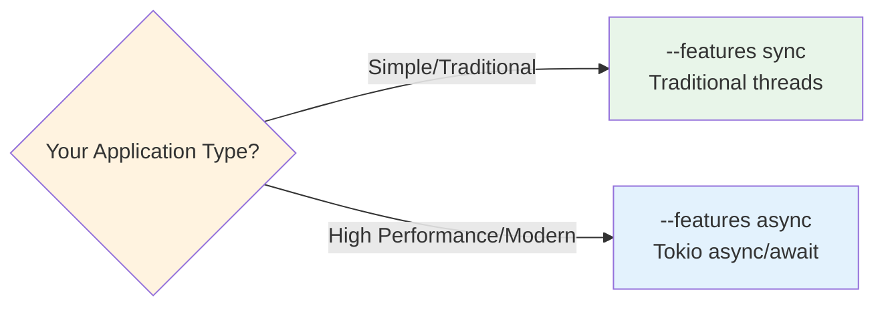

# Quick Start Guide

Get up and running with rust-ibapi in minutes.

## Prerequisites

Before you begin, ensure you have:
1. **Rust installed** - [Install Rust](https://www.rust-lang.org/tools/install)
2. **IB Gateway or TWS** - Running and configured for API connections
3. **Git** - For cloning the repository

## Critical: Choose Your Feature

⚠️ **rust-ibapi requires exactly ONE feature flag:**


```mermaid
graph LR
    Choice{Your Application Type?}
    Sync[--features sync<br/>Traditional threads]
    Async[--features async<br/>Tokio async/await]
    
    Choice -->|Simple/Traditional| Sync
    Choice -->|High Performance/Modern| Async
    
    style Choice fill:#fff3e0
    style Sync fill:#e8f5e9
    style Async fill:#e3f2fd
```

- **`async` (default)** - Modern asynchronous execution using tokio
- **`sync`** - Traditional synchronous client; can be enabled on its own or alongside `async`

When both features are enabled, the async client remains on `client::Client` and the blocking client moves under `client::blocking::Client`.

## Installation

### As a Dependency

Add to your `Cargo.toml`:

v3.0 is not yet on crates.io. Install from git while it's in development; v2.x users should pin a `2.0` version from crates.io instead.

```toml
[dependencies]
# Default async client (v3.0 from git)
ibapi = { git = "https://github.com/wboayue/rust-ibapi", branch = "main" }

# Sync-only (disable defaults)
ibapi = { git = "https://github.com/wboayue/rust-ibapi", branch = "main", default-features = false, features = ["sync"] }

# Async + blocking together
ibapi = { git = "https://github.com/wboayue/rust-ibapi", branch = "main", default-features = false, features = ["sync", "async"] }
```

### For Development

```bash
# Clone the repository
git clone https://github.com/wboayue/rust-ibapi.git
cd rust-ibapi

# Verify installation
cargo build                                # default async client
cargo build --no-default-features --features sync
cargo build --all-features
```

## Your First Example

### Step 1: Start IB Gateway/TWS

Ensure your IB Gateway or TWS is running with API connections enabled:

| Platform | Paper Trading | Live Trading |
|----------|--------------|--------------|
| IB Gateway | 127.0.0.1:4002 | 127.0.0.1:4001 |
| TWS | 127.0.0.1:7497 | 127.0.0.1:7496 |

### Step 2: Run a Simple Example

#### Sync Version

Create `src/main.rs`:

```rust
use ibapi::client::blocking::Client;
use ibapi::prelude::*;

fn main() -> Result<(), Box<dyn std::error::Error>> {
    // Connect to IB Gateway Paper Trading
    let client = Client::connect("127.0.0.1:4002", 100)?;

    // Request current time
    let server_time = client.server_time()?;
    println!("Server time: {server_time}");

    // Request the account summary for every linked account. `AccountSummaryTags::ALL`
    // is a slice of every supported tag. The subscription terminates after IBKR
    // sends `AccountSummaryResult::End`.
    let summary = client.account_summary(&AccountGroup::from("All"), AccountSummaryTags::ALL)?;
    for item in summary.iter_data() {
        match item? {
            AccountSummaryResult::Summary(row) => {
                println!("{}: {} {}", row.tag, row.value, row.currency);
            }
            AccountSummaryResult::End => break,
        }
    }

    Ok(())
}
```

Run with:
```bash
cargo run
```

(The `default-features = false, features = ["sync"]` you set in `Cargo.toml`
above already selects the blocking client; no extra flags needed.)

#### Async Version

Create `src/main.rs`:

```rust
use ibapi::prelude::*;

#[tokio::main]
async fn main() -> Result<(), Box<dyn std::error::Error>> {
    // Connect to IB Gateway Paper Trading
    let client = Client::connect("127.0.0.1:4002", 100).await?;

    // Request current time
    let server_time = client.server_time().await?;
    println!("Server time: {server_time}");

    // Request the account summary for every linked account.
    let summary = client.account_summary(&AccountGroup::from("All"), AccountSummaryTags::ALL).await?;
    let mut summary = summary.filter_data();
    while let Some(item) = summary.next().await {
        match item? {
            AccountSummaryResult::Summary(row) => {
                println!("{}: {} {}", row.tag, row.value, row.currency);
            }
            AccountSummaryResult::End => break,
        }
    }

    Ok(())
}
```

Run with:
```bash
cargo run
```

## Common Operations

### Creating Contracts

The library provides a type-safe contract builder API:

```rust
// Simple stock contract
let stock = Contract::stock("AAPL").build();

// Option with required fields enforced at compile time
let option = Contract::call("AAPL")
    .strike(150.0)
    .expires_on(2024, 12, 20)
    .build();
```

For detailed documentation on creating all contract types, see the [Contract Builder Guide](contract-builder.md).

### Requesting Market Data

```rust
// Define a stock contract
let contract = Contract::stock("AAPL").build();

// Request real-time bars (sync) — defaults to Trades + Regular trading hours.
// `iter_data()` strips notice items so the loop body sees `Result<Bar, Error>`.
let subscription = client.realtime_bars(&contract).subscribe()?;
for bar in subscription.iter_data() {
    let bar = bar?;
    println!("Price: {}, Volume: {}", bar.close, bar.volume);
}

// Request real-time bars (async). `filter_data()` is the async equivalent.
let subscription = client.realtime_bars(&contract).subscribe().await?;
let mut bars = subscription.filter_data();
while let Some(bar) = bars.next().await {
    let bar = bar?;
    println!("Price: {}, Volume: {}", bar.close, bar.volume);
}
```

### Placing Orders

```rust
// Submit a market order via the canonical fluent path.
// `submit()` allocates the order id internally and is fire-and-forget;
// monitor status through `client.order_update_stream()`.
let contract = Contract::stock("AAPL").build();
let order_id = client.order(&contract)
    .buy(100)
    .market()
    .submit()?;
```

### Getting Account Information

```rust
// Stream position updates. Each item is `PositionUpdate::Position(_)` until
// IBKR sends `PositionUpdate::PositionEnd`. `iter_data()` strips notices.
let positions = client.positions()?;
for update in positions.iter_data() {
    match update? {
        PositionUpdate::Position(p) => {
            println!("{}: {} shares", p.contract.symbol, p.position);
        }
        PositionUpdate::PositionEnd => break,
    }
}

// For a snapshot of account values (NetLiquidation, BuyingPower, etc.), use
// `account_summary` with the tags you care about (see `AccountSummaryTags`).
```

## Running Examples

The repository includes many examples in the `examples/` directory:

```bash
# List all examples
ls examples/

# Run a sync example
cargo run --features sync --example account_summary

# Run an async example  
cargo run --features async --example async_account_summary

# Run with debug logging
RUST_LOG=debug cargo run --features sync --example market_data
```

### Popular Examples

| Example | Description | Command |
|---------|-------------|---------|
| `account_summary` | Display account information | `cargo run --no-default-features --features sync --example account_summary` |
| `market_data` | Stream real-time quotes | `cargo run --no-default-features --features sync --example market_data` |
| `place_order` | Place a simple order | `cargo run --no-default-features --features sync --example place_order` |
| `historical_data` | Fetch historical bars | `cargo run --no-default-features --features sync --example historical_data` |
| `contract_details` | Get contract information | `cargo run --no-default-features --features sync --example contract_details` |

For async versions, the default features are sufficient: `cargo run --example async_<name>`.

## Troubleshooting

### Common Issues and Solutions

#### "No feature specified" Error
```bash
error: no feature specified. Enable either 'sync' or 'async' feature
```
**Solution**: If you've disabled default features, add `--features sync` or `--features async` to your command.

#### "Mutually exclusive features" Error
```bash
error: features 'sync' and 'async' are mutually exclusive
```
**Solution**: Update to the latest release—current versions support enabling both features simultaneously.

#### Connection Refused
```bash
Error: Connection refused (os error 111)
```
**Solution**: 
1. Ensure IB Gateway/TWS is running
2. Check the port number (4002 for paper, 4001 for live)
3. Enable API connections in IB Gateway/TWS settings

#### API Not Configured
```bash
Error: API connection not configured
```
**Solution**: In IB Gateway/TWS:
1. Go to Configuration → API → Settings
2. Enable "Enable ActiveX and Socket Clients"
3. Add 127.0.0.1 to trusted IPs
4. Disable "Read-Only API"

#### No Market Data Permissions
```bash
Error: No market data permissions
```
**Solution**: Ensure your IB account has market data subscriptions for the requested symbols.

### Debug Logging

Enable detailed logging to troubleshoot issues:

```bash
# Basic debug logging
RUST_LOG=debug cargo run --features sync --example your_example

# Trace-level logging (very verbose)
RUST_LOG=trace cargo run --features sync --example your_example

# Log only ibapi messages
RUST_LOG=ibapi=debug cargo run --features sync --example your_example

# Record all TWS messages for analysis
IBAPI_RECORDING_DIR=/tmp/tws-messages cargo run --features sync --example your_example
```

### Getting Help

1. **Check the examples** - Most common use cases are demonstrated
2. **Read the API docs** - `cargo doc --open --features sync`
3. **Review test cases** - Tests show expected behavior
4. **GitHub Issues** - Search existing issues or create a new one
5. **Documentation** - See [docs/](.) for detailed guides

## Next Steps

Now that you're up and running:

1. **Explore More Examples** - Check out the `examples/` directory
2. **Read the Architecture Guide** - Understand how rust-ibapi works internally
3. **Learn the API Patterns** - See [API Patterns](api-patterns.md)
4. **Contribute** - See [Contributing Guide](../CONTRIBUTING.md)

## Quick Reference

### Essential Commands

```bash
# Build
cargo build --features sync      # or --features async

# Test
cargo test --features sync       # or --features async

# Run example
cargo run --features sync --example example_name

# Generate docs
cargo doc --open --features sync

# Check code
cargo clippy --features sync -- -D warnings
cargo fmt --check
```

### Connection Endpoints

| Environment | Host | Port |
|------------|------|------|
| IB Gateway Paper | 127.0.0.1 | 4002 |
| IB Gateway Live | 127.0.0.1 | 4001 |
| TWS Paper | 127.0.0.1 | 7497 |
| TWS Live | 127.0.0.1 | 7496 |

### Feature Selection Guide

Choose **sync** if you:
- Are new to Rust async programming
- Want simpler, traditional code
- Don't need high concurrency
- Prefer familiar thread-based patterns

Choose **async** if you:
- Need high performance
- Want to handle many concurrent operations
- Are comfortable with async/await
- Use other async libraries (tokio ecosystem)

Remember: You must choose exactly one!
